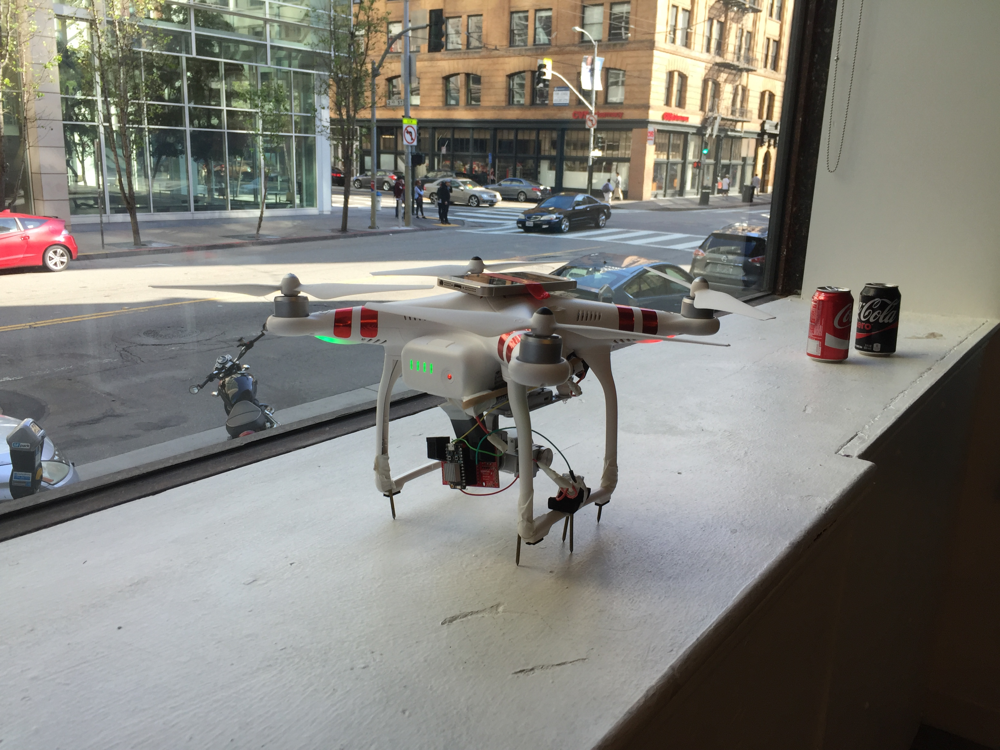

# NASA SpaceApps Hackathon Challenge



### Project

Build a drone that collects information about the environment for farmers and such to reduce water usage and spread awareness about the drought in California. Please ignore the swear words in the commit messages. We built this at a hackathon and we were really tired. Won the NASA SpaceApps Best App/Tech Idea prize!

### How it works

You can either use Alexa, iOS app, or web server to call the drone to a specific destination where it will land and plant the soil sensor into the ground. The soil sensor will then send JSON data back to the server where it will be saved. The iOS app/web server will be able to show the data in a more human readable format. The drone flies back to the original destination and lands.

[NASA SpaceApps Award Ceremony](https://youtu.be/amSe2ljWaQ8?t=1m36s)

[School Presentation](https://docs.google.com/presentation/d/1kzU7ss0bI7V-H4xewemgdc0ty74xs3NXN1tIdO1CHqs/edit?usp=sharing)

### How to run

Clone the repo
```bash
$ git clone https://github.com/DevinMui/nasa/
```

Go to the directory
```bash
$ cd nasa/
```

Turn on the Node.js server

```bash
$ sudo node index.js
```

Run the iOS app under `DroneControl/` on XCode

Make an AWS account to register for AWS Lambda for Alexa

Drag and drop the zipped content of the `alexa/` folder

### Process

Before we arrived at the hackathon, we did some preliminary brainstorming. There were several areas of interest we could choose to develop and we chose to develop for the environment and agriculture. We wanted to help the world and improve society. California was in a drought at the time so we figured that we should create an application that regulated people's usage of water. We chose to provide data about farmer's water usage and to track their crop health based on moisture, temperature, and pH readings. At the hackathon, the first thing we did was divide up a series of tasks. We knew we needed to create an app to control the drone, sensors to capture data, and a server to store and process the data. In a few hours, a simple server was finished. In a few more hours, the sensors were created and taped onto a drone. Then, the venue closed for the night and everyone went home. We continued building our project. By midnight, the drone was able to fly to a destination without manual guidance. We allowed multiple points and also created the Alexa skill. We tested the drone at Golden Gate Park and it worked. We went back to the venue and realized that the Photon could not connect to their WiFi. We taped an iPhone 5 onto the drone to provide a hotspot for the Photon. However, this caused the drone the be imbalanced and tip over. We were forced to add counterweights to balance the drone. We presented the project to the hackathon and we won the Best App/Tech Idea award.

### Challenges

This was our first time using many new technologies. We had to use the DJI iOS SDK. We downloaded their example code and used one of their files as a template for the drone controller. We had never created an Alexa skill before and had a series of problems running it on AWS Lambda. We realized that Alexa only works for Lambda in specific regions so we had to change our server region to fix that problem. Other than that, the Alexa skill was simple to create as we could use Node.js to develop it quickly. We had also never worked with the Particle Photon before. We got a few of them for free at a previous hackathon and thought we could use them as a better Arduino. However, the Photon was unable to connect to the event's WiFi and we were unable to figure out why. We realized that the Photon could not connect to networks with a terms and conditions accept screen so we were forced to use a mobile hotspot to fix that problem. The server, however, was relatively simple to create and if we had more time, we would have made it more modular and we would have designed the front end better. 

### TODO

- [ ] make android app (optional)
- [x] make ios app ~ 2 - 5 hours
- [x] make hardware hack ~ 1 hour
- [x] make alexa app ~ 3 - 5 hours (optional)
- [x] server ~ 15 - 30 minutes

### Contributors

Devin Mui - back end developer

Jesse Liang - iOS/drone developer

Derrick Ng - hardware developer
